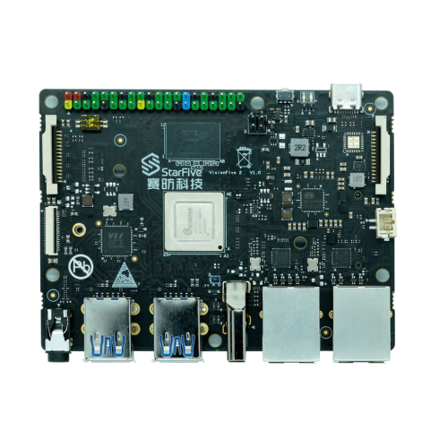
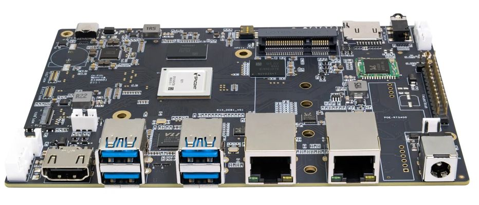
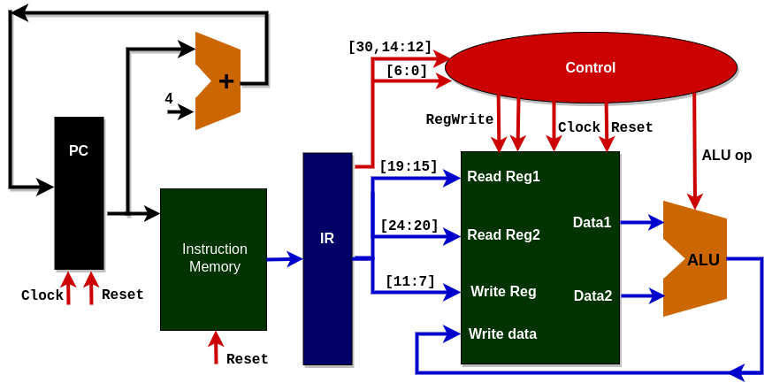
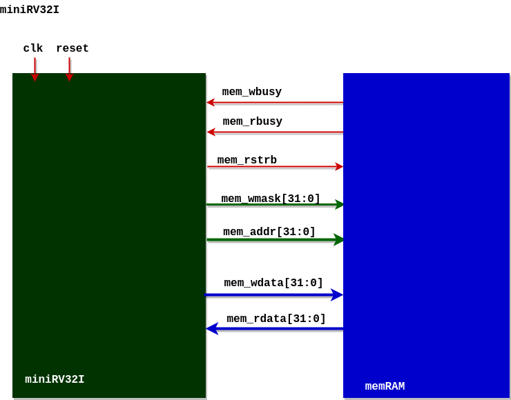

<picture>
 
</picture>

# PLabs RISC-V programming 
This repository contains the preparations for RISC-V labs (PLabs and DLabs)
The first three labs deal with **assembly level programming**. We start in **Lab1** with simple arithmetical examples, 
and we continue with **Lab2**  to cover simple system and network oriented examples.
## Hardware 
Our labs are carried on RISC-V SBCs that are StarFive VisionFive2 and BPI-F3 boards.
<picture>
 
</picture> 
**VisionFive 2** is the world’s first high-performance RISC-V single board computer (SBC) with an integrated GPU. 
The board is based on JH7110 64-bit SoC with **RV64GC** instruction set.
The SoC is integrated with IMG BXE-4-32 MC1, supporting OpenCL 3.0, OpenGL ES 3.2, and Vulkan 1.2. Available with 2/4/8 GB LPDDR4 RAM options, VisionFive 2 provides rich I/O peripherals such as M.2 connector, eMMC socket, USB 3.0 ports, a 40-pin GPIO header, Gigabit Ethernet ports, a TF card slot, and many more. 
It has onboard audio and video processing capabilities and has MIPI-CSI and MIPI-DSI connectors as multimedia peripherals. The open source SBC also provides wide software compatibility including support for Debian.
<picture>
 
</picture> 
**BPI-F3 withSpacemiT K1** is first high-performance RISC-V SBC with 8-cores, each implementing RV64GCVB extension and additional AI instructions.

## Software
The VisionFive 2 board operates with Debian OS. The system contains all nessary packages and libraries to carry software and hardware development exercises.
The software development is based on C/C++ and assembly language.
The hardware development is based on Verilog (iverilog) and GTKWave graphic environment.

# DLabs - RISC-V architecture desription and modeling - design projects
The first project in Lab 3 is based on simple RISC-V (RV32: R-type) model in Verilog.
<picture>
 
</picture>

## Project structure and tools
+ Each sub-unit is created in its own directory
+ Each directory contains the modules used in this particular unit
+ Additionally it consists of testbenc used to test and debug those modules
+ The final processor implementation is in the directory - Processor
+ This uses all the relevant units and integrates them to provide working processor

### iVerilog:
While there are many compilers for verilog present, not many of them are open source, and even fewer are robust, user-friendly and updated regularly. Icarus Verilog checks all boxes and can be learnt easily with this really helpful wiki setup for it.

### GTKWave:
Another really powerful open source tool that was essential in building this project was GTKWave. It helps to view vcd and other waveforms. Really important for debugging and understanding if dependencies of different signals are as described by you.

## Getting Started
This is an example of how you may give instructions on setting up your project locally. To get a local copy up and running follow these simple example steps.

### Setting up instructions
Before we begin to run our processor we must initialize the instruction memory with the desired sequence of instructions that we want to execute. By default 8 instructions are included that will execute in that particular sequence of initialization.

### Initializing the register file
In order to implement instructions we must have values in the register to act upon, these values can be initialized in the register file. By default each register is initialized to have a value the same as the register number - 1. Example: Register 14 will have value 13.

### Running the processor
Once the above initializations have been done as desired, compile the file "Processor_tb.v" using iverilog using the following command:
+ compilation
  
**iverilog -o gen-compiled Processor_tb.v** 

The above command generates a compile file named as "gen-compiled". After compilation we can execute the compiled file using:

+ execution

**vvp gen-compiled**

### Viewing waveform

The waveform generated from testbench is named as **output_wave.vcd**
Use GTKWave to view the waveform file

**gtkwave output_wave.vcd**

<picture>
 
</picture>

## Lab 4
The second project invloves RISC-V model (miniRV321) for complete set of **I instructions**
<picture>
 
</picture>
